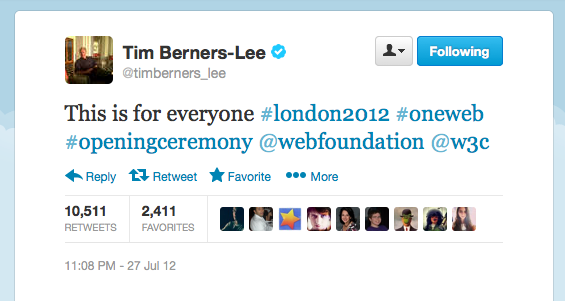

<!-- .slide: data-background="gfx/home.jpg" -->
# Look, no media queries! <!-- .element: style="color: white; text-shadow: 1px 1px 0 black;" -->
Vasilis van Gemert — Frontend Conference Zürich <!-- .element: style="color: white; text-shadow: 1px 1px 0 black;" -->

<!-- .slide: data-background="gfx/bl-original.jpg" data-background-size="contain" -->

Mike Kus

<!-- .slide: data-background="gfx/bl-kus-big.jpg" data-background-size="contain" -->

<!-- .slide: data-background="gfx/bl-muur.jpg" data-background-size="contain" -->

<!-- .slide: data-background="gfx/bl-stencil.png" data-background-size="contain" -->

<!-- .slide: data-background="gfx/bl-stencil-1.png" data-background-size="contain" -->

<!-- .slide: data-background="gfx/bl-auto.jpg" data-background-size="contain" -->

<!-- .slide: data-background="gfx/bl-opnieuw_1.jpg" data-background-size="contain" -->

<!-- .slide: data-background="gfx/bl-opnieuw_2.jpg" data-background-size="contain" -->

<!-- .slide: data-background="gfx/bl-opnieuw_3.jpg" data-background-size="contain" -->

<!-- .slide: data-background="gfx/bl-opnieuw_4.jpg" data-background-size="contain" -->

<!-- .slide: data-background="gfx/bl-opnieuw_5.jpg" data-background-size="contain" -->

<!-- .slide: data-background="gfx/bl-opnieuw_6.jpg" data-background-size="contain" -->

<!-- .slide: data-background="gfx/bl-opnieuw_7.jpg" data-background-size="contain" -->

<!-- .slide: data-background="gfx/bl-opnieuw_8.jpg" data-background-size="contain" -->

<!-- .slide: data-background="gfx/bl-opnieuw_9.jpg" data-background-size="contain" -->

<!-- .slide: data-background="gfx/bl-opnieuw_10.jpg" data-background-size="contain" -->

<!-- .slide: data-background="gfx/bl-opnieuw_11.jpg" data-background-size="contain" -->

<!-- .slide: data-background="gfx/bl-opnieuw_12.jpg" data-background-size="contain" -->

<!-- .slide: data-background="gfx/bl-font-size-1.png" data-background-size="contain" -->

<!-- .slide: data-background="gfx/bl-font-size-2.png" data-background-size="contain" -->

<!-- .slide: data-background="gfx/bl-font-size-1.png" data-background-size="contain" -->

<!-- .slide: data-background="gfx/bl-font-size-3.png" data-background-size="contain" -->

<!-- .slide: data-background="gfx/bl-square.png" data-background-size="contain" -->

<!-- .slide: data-background="gfx/bl-opera.png" data-background-size="contain" -->

<!-- .slide: data-background="gfx/bl-ie8.png" data-background-size="contain" -->

Note: But we're very happy IE8 is not relevant anymore. So yes, we have to think about exotic browsers, but we also have to think about the future. And especially about the present: how can we present our content to our visitors? CSS is changing fast, many new things have been implemented recently, we have to stay up to date. And I'm not here to talk about creating stuff that works everywhere, I'd love to come back next year to do just that, but I'm here to talk about creating layouts without media queries. Now, why?

<!-- .slide: data-background="gfx/screensizes.jpg" data-background-size="cover" -->

Photo: Rafaël Rozendaal

Note: This has always fascinated me about the web: not the fact that students can afford these extremely expensive macbooks, but these mirrors on the wall: they’re all different screens sizes of often used devices, back in 2011 or something. If we'd make this work of art today, we'd need this whole university to display all different sizes. All these different sizes means that we'll need different layouts. And a few years ago we started using media queries to do that. And thanks to mediaqueries we were able to do stuff like this:

<!-- .slide: data-background="gfx/bl-screen-size-1.png" data-background-size="contain" -->

<!-- .slide: data-background="gfx/bl-screen-size-2.png" data-background-size="contain" -->

<!-- .slide: data-background="gfx/bl-screen-size-3.png" data-background-size="contain" -->

<!-- .slide: data-background-video="gfx/balls-big-animate.webm" -->
Note: Ik heb deze animatie gemaakt om te laten zien hoe dit werkt

<!-- .slide: data-background-video="gfx/balls-medium-animate.webm" -->
Note: en daarna moest ik ook nog dit breakpoint maken. Fuck it.

> CSS grid systems are actually grid prescriptions. If something is a system it has to be self-governing, it has to be able to make decisions for itself and for us

— Heydon Pickering
